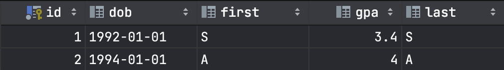

## Assignment 1

- Saintur Batkhuu
- Sumayya Jahan
- Yumjirdulam Chinbat
- Samreth Kem
## How to run

It may take minutes, because stages of building jar file using Dockerfile will install all the maven dependencies. 

```
docker-compose up -d
```

### Use API interface

```shell
Use "request.http" file in the project
```

### Sign in

```shell
curl -v -X POST -H "Content-Type: application/json" -d '{"username":"admin@miu.edu", "password":"admin"}'  http://localhost:8080/api/uaa/signin 
```

### Start batch

```shell
export TOKEN=${access_token}
curl -v -H "Content-Type: application/json" -H "Authorization: Bearer ${TOKEN}" http://localhost:8080/api/data/batch
```

### CSV Content

S,S,3.4,30

A,A,4.0,28

### After Batch Data table result



### DB connection

```shell
database: postgres
username: postgres
password: postgres
port: 5432
connection: jdbc:postgresql://localhost:5432/postgres
```

# Instructions

Objective: Get you up to speed with some technologies you’ll need in this class to successfully build cloud native microservices solutions.


Feel free to discuss Ideas but refrain from sharing implementations. Violating honor code is not allowed.

###  Task:

Implement a Restful service allowing an admin to trigger a batch job.

The batch job , reads a CSV file and writes its contents into Mysql DB after performing some conversion.

### CSV file format:

First , last , GPA , AGE

String, String,Double, INT>0

### Database table format:

First , last , GPA , DOB

String, String,Double, Date ( first day of the year)

### Deliverable:

- You service should implement security, only admin can access it

- Your batch will be executed once , feel free to remove DB contents every time your app starts

- Docker your solution along with README.md file to explain how to run it

### Hints:

- Spring MVC/Restful , ORM , Spring security ( optionally with JWT tokens)

- Spring Batch

- Docker and usage of docker-compose. Don’t create DB image , use docker hub

- Upload only source code files , put your CSV  file inside your  app image